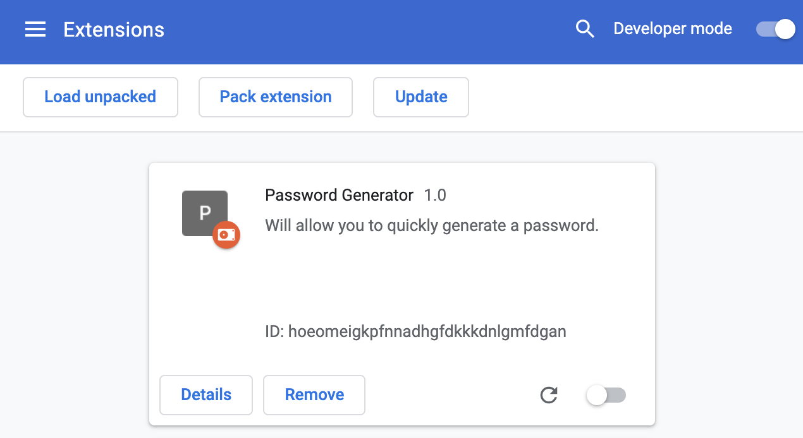

# Password Generator Chrome Extension

## Installation
- Download the `Source code (zip)` file from [here](https://github.com/hwbrent/Password-Generator-Chrome-Extension/releases/tag/v1.0.0).
- Open the Extension Management page by navigating to [chrome://extensions](chrome://extensions).
  - Or, you can click on the Extensions menu button, then select Manage Extensions at the bottom of the menu.
  - Or, you can click on the Chrome menu, then hover over More Tools, then select Extensions.
- Enable Developer Mode by clicking the toggle switch labelled `Developer Mode` in the top right of the window (after clicking it, it should appear as per the below image).
- Click the Load unpacked button, then select the folder containing the code for the extension.

- After that, the extension should appear!
    - (You might also need to click `Update`)
